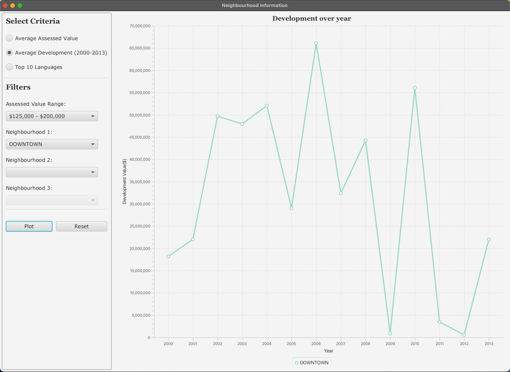

# Edmonton Dashboard

## Explore Edmonton's neighbourhood insights through interactive visualizations.

<table>
  <tr>
    <td align="center">
      
    </td>
    <td align="center">
      
    </td>
    <td align="center">
      
    </td>
    <td align="center">
      
    </td>
  </tr>
</table>


## Overview

This Java-based application brings Edmonton's neighbourhood data to life through informative visualizations. It empowers you to explore and compare neighbourhoods based on various criteria, gaining valuable insights into the city's demographics and development trends.

## Features
- **Visualizations:**
    - Average Assessed Value of Properties (Bar Graph)
    - Average Development Spending 2000-2013 (Line Graph)
    - Top 10 Languages Spoken (Bar Graph)
- **Interactive Controls:**
    - Filter neighbourhoods based on average assessed value ranges.
    - Compare up to 3 neighbourhoods simultaneously for development spending and language data.
- **Data Source:**
    - Utilizes publicly available datasets from the Edmonton Open Data Portal.

## Usage
1. Clone the repository:
````git clone https://github.com/BalkiratS/Edmonton_Dashboard.git````
2.  Navigate to the Project directory:
 ````cd Edmonton_Dashboard````
3.  Build and run the application
    - Follow the instructions specific to your Java development environment to compile and execute the project's main class.

## Data
- Datasets: Located in ````src/main/resources/Datasets````
- Source: Downloaded from the Edmonton Open Data Portal (https://data.edmonton.ca/)

## License
This project is licensed under the Apache License - see the [LICENSE](LICENSE.txt) file for details.
